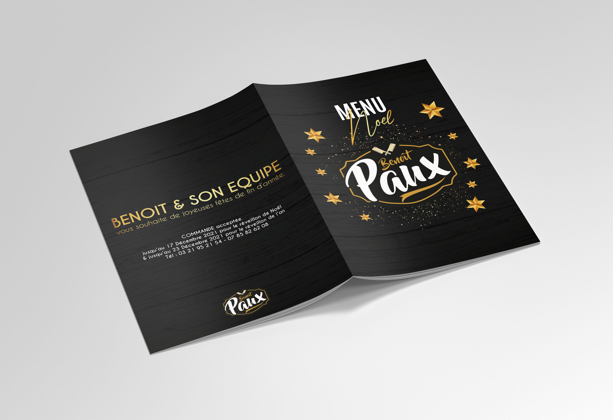

# Ca va être une vraie boucherie ici 🐄->🥩

👋 Hello les ami.es, vous n'êtes pas ici 📍 par hasard.   
Si vous êtes de passage sur ce repo Git, c'est que vous avez survécu à la formation et **Félicitations !**   
Si vous êtes ici, c'est que vous souhaitez continuer à apprendre et a monter en compétence.   
Si vous êts ici, c'est que vous voulez devenir Dev.   
Eh bien bravo, tu es sur le bon Repo.   

Ce brief sera ton brief **Chef d'oeuvre de fin de formation**. Il rassemble toutes les compétences acquises depuis le début de ta formation.
# le brief

La *Boucherie Benoît Paux* vient d'ouvrir récemment son commerce. Expert en la matière et faisant la meilleure viande des Hauts-De-France (placement de produit 😅), son activité c'est bien développé. Un traiteur a rejoint l'équipe et comme tous les ans, il va proposé sa carte pendant les fêtes. Aujourd'hui les commandes se font par téléphone, directement à la boucherie et tout est noté sur un cahier (et oui le papier n'est pas mort).   
Vous l'aurez compris, en tant que Dev on ne peut pas rester sans rien faire. Grâce à nos supers pouvoirs, on se doit de mettre en place une solution pour automatiser tout ça.   
L'idée est simple, mettre en place un solution de prise de commande pour les clients.   
Les commandes seront visibles via une interface admin pour le traiteur avec suivi.   
L'idée également est de pouvoir à la création de produit (pour la boucherie) indiquer le détail du produit.   
Exemple pour une Bouchée à la reine : 200g de champignon, 45g de beure, 3 c.à.s de farine, 75cl de bouillon, etc...   
La recette se sera pas visible pour l'utilisateur mais uniquement pour le traiteur. L'idée, donner un indicateur de quantité de produits à acheter pour fabriquer ses repas.   
___
- **LA priorité**, mettre à disposition sur un site, les produits en vente lors des fêtes de fin d'année.   
- la création d'un compte client et la gestion d'un panier de prise de commande.
- la réception par mail pour le client mais aussi le traiteur de la prise de commande.
- mettre en place le dashboard pour le traiteur (suivi de commande et qté de produits à commander pour la préparation des plats)
- **bonus** paiement en ligne   

# les étapes
- concevoir un CDC
- concevoir une maquette [logo](./images/logo@1000x.png), [la carte 2021](./images/menu_2021.jpg)
- concevoir le diagramme de classe
- intégrer la maquette en mode Mobile First (Framework CSS)
- concevoir la BDD
- mettre en place la BDD
- développer les composants d'accès à la BDD
- développer le dashboard admin
- mettre en ligne la solution   
**Le travail se fera en équipe de 3 ou 4 maximum avec une méthodologie agile.**   

